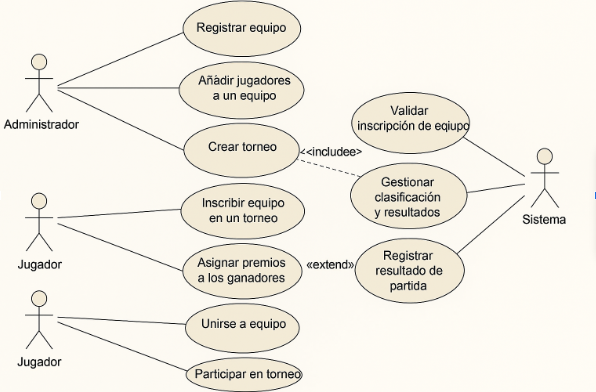
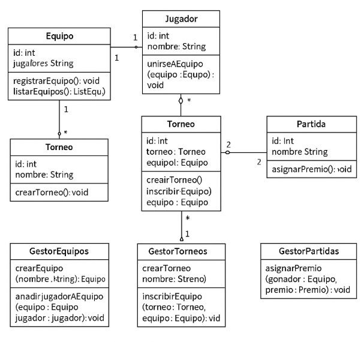

# Sistema de Gestión de Torneos de eSports

## Descripción del Proyecto

Este proyecto tiene como objetivo el diseño y desarrollo de un sistema de gestión para torneos de eSports, aplicando los principios de la Programación Orientada a Objetos (POO) y utilizando diagramas UML para modelar su estructura y funcionalidad. El sistema permite gestionar equipos, jugadores, torneos, partidas, resultados y premios, facilitando la organización y administración de torneos de forma eficiente.

---

## Diagrama de Casos de Uso

### Descripción del Diagrama de Casos de Uso

El diagrama de casos de uso representa las interacciones entre los usuarios del sistema (actores) y las funcionalidades del sistema (casos de uso). Los actores principales identificados son:

- **Administrador**: Gestiona equipos, jugadores, torneos y premios.
- **Jugador**: Se registra en equipos y participa en torneos.
- **Sistema**: Gestiona la creación de torneos, asignación de premios y otros procesos automáticos.

Los principales casos de uso son:

1. **Gestión de equipos y jugadores**:
    - Registrar equipo.
    - Añadir jugadores a un equipo.
    - Consultar lista de equipos y jugadores.

2. **Gestión de torneos**:
    - Crear un torneo.
    - Inscribir equipo en un torneo.
    - Generar emparejamientos de partidas.

3. **Gestión de partidas y resultados**:
    - Registrar resultado de una partida.
    - Actualizar clasificación del torneo.

4. **Gestión de premios**:
    - Asignar premios a los ganadores.

---

## Diagrama de Clases UML

### Descripción del Diagrama de Clases

El diagrama de clases describe la estructura del sistema y cómo se organizan las clases en tres categorías: **Entidad**, **Control** e **Interfaz**.

- **Clases de Entidad**:
    - **Equipo**: Representa un equipo en el torneo, con atributos como nombre y lista de jugadores.
    - **Jugador**: Representa a un jugador con atributos como nombre, posición y equipo al que pertenece.
    - **Torneo**: Representa un torneo, con atributos como nombre, fecha y lista de equipos inscritos.
    - **Partida**: Representa una partida dentro de un torneo, con atributos como equipos enfrentados y resultado.
    - **Premio**: Representa un premio otorgado al ganador de un torneo o partida.

- **Clases de Control**:
    - **GestorEquipos**: Controla la creación de equipos y la asignación de jugadores a estos.
    - **GestorTorneos**: Controla la creación de torneos, inscripción de equipos y generación de emparejamientos.
    - **GestorPartidas**: Controla el registro de resultados de partidas y la actualización de la clasificación del torneo.
    - **GestorPremios**: Controla la asignación de premios a los ganadores.

- **Clases de Interfaz**:
    - **VistaEquipo**: Proporciona la interfaz para interactuar con los equipos.
    - **VistaTorneo**: Proporciona la interfaz para interactuar con los torneos y partidas.
    - **VistaPremio**: Proporciona la interfaz para la gestión de premios.

---

## Justificación del Diseño

El diseño del sistema sigue los principios de la Programación Orientada a Objetos (POO), con una clara separación entre las clases de entidad, control e interfaz. Esta estructura modular facilita el mantenimiento y la escalabilidad del sistema, permitiendo agregar nuevas funcionalidades sin alterar el comportamiento de las existentes.

### Clases de Entidad
Las clases de entidad representan los objetos fundamentales del sistema (equipos, jugadores, torneos, partidas, premios) y contienen la lógica relacionada con sus atributos.

### Clases de Control
Las clases de control gestionan la interacción entre los usuarios y las entidades del sistema, asegurando que las operaciones (como registrar equipos, inscribir en torneos, registrar resultados) se realicen correctamente.

### Clases de Interfaz
Las clases de interfaz proporcionan la interacción con los usuarios, permitiendo la entrada y salida de datos en la consola o interfaz gráfica (según sea necesario).

Este enfoque facilita la reutilización de código y asegura que cada clase tenga una única responsabilidad, siguiendo el principio de responsabilidad única.

---

## Conclusiones

Al realizar este proyecto, he aprendido a aplicar conceptos de Programación Orientada a Objetos (POO) para diseñar sistemas modulares y escalables. El uso de diagramas UML ha sido clave para visualizar las interacciones y la estructura del sistema, ayudando a definir claramente las relaciones entre los diferentes componentes del sistema.

Al implementar el sistema en Java, pude practicar la organización del código en paquetes, asegurando que el sistema sea fácil de mantener y ampliar. Además, la división del sistema en clases de entidad, control e interfaz mejora la claridad del código y facilita la depuración y las pruebas.

Este proyecto también me ha permitido mejorar mis habilidades en la creación de diagramas UML, que son esenciales para el diseño y la documentación de sistemas complejos. La estructuración adecuada del sistema es clave para garantizar su correcto funcionamiento y facilitar futuras ampliaciones.

---

## Enlaces

- [Repositorio en GitHub](https://github.com/alexMagic7/AlexanderRomanDiaz_Actividad3_ED)
- [Diagrama de Casos de Uso](diagrams/casos-de-uso.png)
- [Diagrama de Clases UML](diagrams/clases.png)
